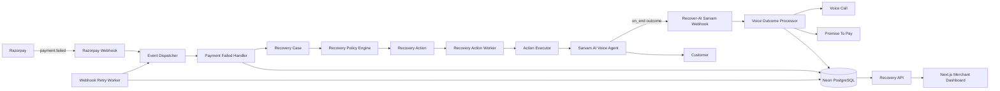
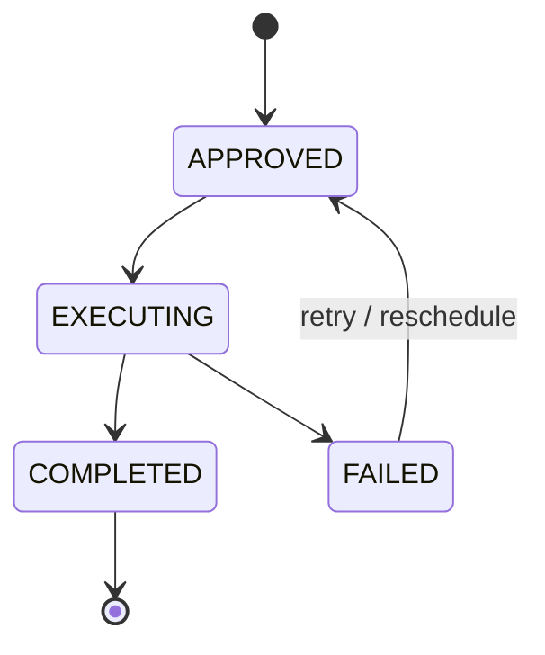
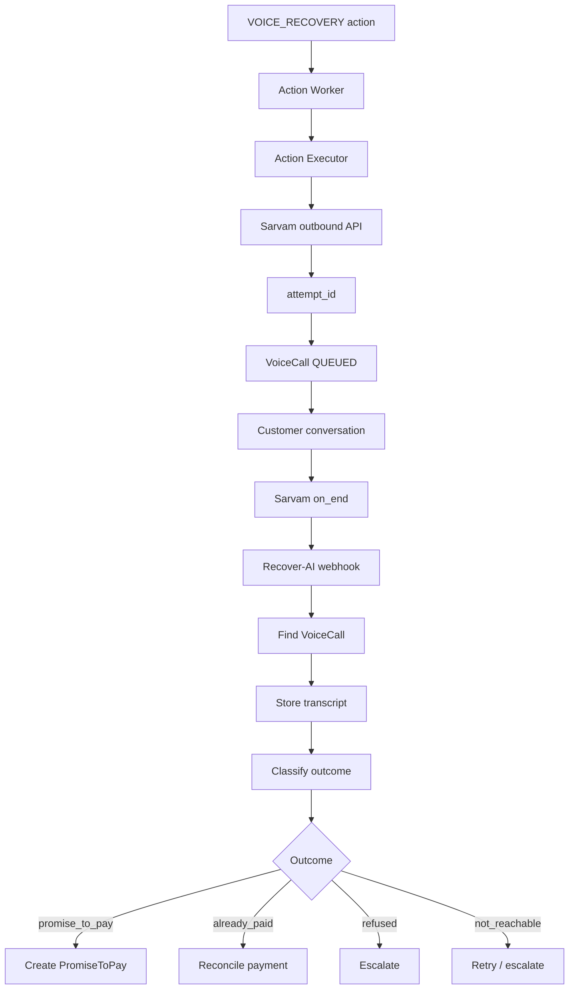

# Recover-AI

> **Automated payment recovery platform that turns failed payments into executable recovery workflows.**

Recover-AI is an event-driven payment recovery system designed to reduce revenue loss after failed digital payments. Instead of treating a failed payment as an isolated event, Recover-AI converts it into a persistent recovery case, evaluates the next recovery action, executes that action asynchronously, and records the customer outcome.

The current flagship recovery flow uses **Sarvam AI** for automated voice recovery: the system initiates an outbound call, conducts a natural-language conversation, validates a promised payment date, receives the completed-call webhook, and converts the conversation into structured recovery data.

**Core idea:**

```text
A failed payment automatically becomes an executable recovery workflow.
```

---

## Why Recover-AI?

A payment failure is only the beginning of the recovery problem.

After a payment fails, a merchant needs to know:

- Which customer was affected?
- What amount is at risk?
- Why did the payment fail?
- What recovery action should happen next?
- Has the customer already paid?
- Did the customer promise to pay?
- When did they promise to pay?
- Should the case be retried or escalated?
- What actually happened during recovery?

Recover-AI connects these steps into one durable workflow instead of relying on manual follow-ups.

---

# End-to-End Workflow

```text
Razorpay payment fails
          |
          | payment.failed
          v
Webhook verification
          |
          v
Event dispatcher
          |
          v
Payment failure handler
          |
          +----------------------+
          |                      |
          v                      v
Update Payment          Create PaymentAttempt
                               |
                               v
                      Create / reuse RecoveryCase
                               |
                               v
                         Recovery Policy
                               |
                               v
                         RecoveryAction
                               |
                               v
                    Recovery Action Worker
                               |
                               v
                         VOICE_RECOVERY
                               |
                               v
                           Sarvam AI
                               |
                               v
                       Customer phone call
                               |
                               v
                       Customer conversation
                               |
                               v
                     Sarvam on_end webhook
                               |
                               v
                    Voice Outcome Processor
                               |
                  +------------+------------+
                  |            |            |
                  v            v            v
             PromiseToPay   Reconcile    Escalate
                               |
                               v
                       Recovery Dashboard
```

### What happens at each stage

**1. Payment failure:** Razorpay sends a `payment.failed` event.

**2. Webhook layer:** Recover-AI receives and verifies the event before dispatching it.

**3. Event dispatcher:** The event type is routed to the correct domain handler.

**4. Payment failure handler:** The payment is updated, a `PaymentAttempt` is recorded, an active `RecoveryCase` is created or reused, and recovery processing is initiated.

**5. Recovery policy:** The case is evaluated and a `RecoveryAction` is created.

**6. Worker:** A background worker claims the persisted action and executes it.

**7. Voice recovery:** A `VOICE_RECOVERY` action calls Sarvam's outbound voice API.

**8. Conversation:** Sarvam handles the customer interaction and collects structured output such as outcome, promised date, and summary.

**9. `on_end`:** Sarvam sends the completed call data back to `/api/webhooks/sarvam`.

**10. Outcome processing:** Recover-AI correlates the provider call with the internal case, stores the call information, and updates the recovery workflow.

**11. Business outcome:** A successful promise can become a `PromiseToPay`; other outcomes can lead to reconciliation, retry, or escalation according to the implemented workflow.


# Architecture



## Architecture layers

### Client layer

The Next.js merchant dashboard provides visibility into:

- recovery cases
- payment status
- amount at risk
- recovery actions
- voice calls
- Promise-to-Pay records
- audit information
- recovery metrics

### Application layer

The backend contains the domain workflow:

- webhook routes
- event dispatcher
- payment failure handler
- recovery policy
- recovery action services
- action executor
- action worker
- webhook retry worker
- voice outcome processor
- recovery APIs

### Integration layer

Recover-AI communicates with external systems:

```text
Razorpay
   |
   | payment events
   v
Recover-AI
   |
   | recovery call
   v
Sarvam AI
```

During local development, zrok can expose the local API through HTTPS so external providers can deliver webhooks.

### Data layer

PostgreSQL stores durable recovery state through Prisma.

Core entities include:

```text
Merchant
Customer
Payment
PaymentAttempt
RecoveryCase
RecoveryAction
VoiceCall
PromiseToPay
AuditLog
WebhookEvent
VoiceWebhookEvent
```

---

# Repository Structure

```text
recover_ai/
├── apps/
│   ├── api/
│   │   ├── src/
│   │   │   ├── recovery/
│   │   │   ├── webhooks/
│   │   │   ├── voice/
│   │   │   ├── workers/
│   │   │   ├── routes/
│   │   │   └── testing/
│   │   └── package.json
│   │
│   └── web/
│       ├── app/
│       │   ├── cases/
│       │   ├── page.tsx
│       │   └── globals.css
│       └── package.json
│
├── packages/
│   └── database/
│       ├── prisma/
│       │   ├── migrations/
│       │   ├── schema.prisma
│       │   └── seed.ts
│       └── src/
│           ├── client.ts
│           └── generated/
│
├── docs/
│   ├── ARCHITECTURE.md
│   └── BUILDATHON_DEMO.md
│
├── package.json
└── README.md
```

The repository is organized as a workspace with separate API, web, and shared database packages.

---

# Core Components

## Razorpay Webhook Layer

```http
POST /api/webhooks/razorpay
```

This endpoint receives payment events such as `payment.failed`.

The webhook layer is intentionally separated from business logic:

```text
Razorpay
   ↓
Webhook endpoint
   ↓
Verification / persistence
   ↓
Event dispatcher
   ↓
Domain handler
```

This keeps provider-specific event handling at the integration boundary.

---

## Event Dispatcher

The dispatcher maps supported event types to domain handlers.

For example:

```text
payment.failed
       |
       v
Payment Failed Handler
```

Unsupported event types are ignored instead of being sent through an unrelated recovery path.

---

## Payment Failure Handler

The payment failure handler establishes the initial recovery state.

Its responsibilities include:

1. locating the payment
2. extracting failure information
3. updating payment status
4. creating a `PaymentAttempt`
5. creating or reusing an active `RecoveryCase`
6. recording an audit event
7. initiating the recovery action flow

Conceptually:

```text
Payment
  |
  +-- FAILED
  |
  +-- PaymentAttempt
  |
  +-- RecoveryCase
          |
          +-- amountAtRisk
          +-- failureReason
          +-- status
```

An active recovery case can be reused when repeated failure events refer to the same payment, reducing duplicate recovery work.

---

## RecoveryCase

`RecoveryCase` is the central object representing the recovery lifecycle of a failed payment.

It connects:

```text
Payment
   |
   v
RecoveryCase
   |
   +-- RecoveryAction
   +-- VoiceCall
   +-- PromiseToPay
   +-- AuditLog
```

A case carries important recovery context such as:

- payment
- merchant
- amount at risk
- failure reason
- current recovery status
- recovery actions
- customer interaction history
- eventual resolution or escalation

---

# Recovery Policy and Actions

Recover-AI separates **deciding what to do** from **executing the external operation**.

```text
RecoveryCase
     |
     v
Recovery Policy
     |
     v
RecoveryAction
     |
     v
Background Worker
```

For the current automated voice flow, the action type is:

```text
VOICE_RECOVERY
```

A persisted action can be claimed and executed by a worker, allowing the workflow to survive process restarts and temporary provider failures.

## Action lifecycle



Action locking protects against concurrent workers processing the same action.


# Voice Recovery

Voice recovery is the current flagship recovery channel.



## Starting an outbound call

The worker executes the `VOICE_RECOVERY` action and invokes the Sarvam outbound API.

The provider request can contain configured customer/payment context such as:

- customer name
- amount due
- payment status
- agent/application configuration
- telephony connection
- webhook configuration

Sarvam returns an `attempt_id`.

Recover-AI persists the provider identifier on the corresponding `VoiceCall`.

This gives the system a durable correlation chain:

```text
RecoveryCase
     |
     v
RecoveryAction
     |
     v
VoiceCall
     |
     v
Sarvam attempt_id
```

The internal `recovery_case_id` is carried through webhook metadata for provider-to-case correlation. It is an internal identifier and is not intended to be communicated to the customer.

---

# Sarvam AI Integration

Sarvam handles the conversational part of the recovery process.

The integration includes:

- outbound voice call creation
- agent/application configuration
- customer variables
- telephony connection configuration
- webhook configuration
- provider attempt ID persistence
- `on_end` lifecycle processing
- structured call output
- payment-date validation

The system keeps provider-specific configuration at the integration boundary rather than spreading Sarvam-specific assumptions across the recovery domain.

### Important provider boundary

The provider's actual identifier is persisted rather than assuming that the external call ID will always have the same name or format as an internal Recover-AI identifier.

This matters because asynchronous completion events must reliably map back to the original recovery case.

---

# Voice Conversation and Outcome

The voice agent can establish information such as:

- whether the customer is aware of the failed payment
- whether the customer has already paid
- whether they intend to pay
- a concrete promised payment date
- a conversation summary

For example, a customer may say:

```text
"I will pay on 6 September."
```

The configured date-validation flow converts the natural-language date into structured information.

The important transformation is:

```text
Natural language
      ↓
Validated structured outcome
      ↓
Recovery workflow
```

The result is more useful than storing a transcript alone.

---

# Sarvam `on_end` Webhook

```http
POST /api/webhooks/sarvam
```

When the call finishes, Sarvam sends the configured `on_end` payload to Recover-AI.

The payload can contain information such as:

- attempt ID
- provider call ID
- transcript
- outcome
- promised payment date
- call summary
- failure information
- provider metadata

Recover-AI uses the provider identifiers and metadata to correlate the callback with the correct `VoiceCall` and `RecoveryCase`.

---

# Promise to Pay

When the customer commits to paying later, the conversation can become a `PromiseToPay` record.

```text
VoiceCall
   |
   +-- status = COMPLETED
   +-- outcome = PROMISE_TO_PAY
   +-- promised payment date
   |
   v
PromiseToPay
   |
   +-- status = PENDING
   +-- source = VOICE
```

This turns a conversational commitment into structured data that the merchant can track.

---

# Database Design

Prisma manages the PostgreSQL schema.

A simplified domain relationship is:

```text
Customer
   |
   +---- Payment
            |
            +---- PaymentAttempt
            |
            +---- RecoveryCase
                     |
                     +---- RecoveryAction
                     |
                     +---- VoiceCall
                     |
                     +---- PromiseToPay
                     |
                     +---- AuditLog
```

The database is also part of workflow coordination. Important events, actions, provider identifiers, call states, and outcomes are persisted rather than existing only in process memory.

---

# Reliability

A recovery platform must assume that external systems can retry, fail, or become temporarily unavailable.

## Webhook idempotency

The same webhook may be delivered more than once.

Recover-AI persists webhook events and applies duplicate protection so repeated delivery does not blindly create duplicate recovery work.

The same principle applies to Sarvam completion webhooks.

## Recovery-case reuse

If an active recovery case already exists for a payment, the system can reuse it instead of creating another active case.

## Action locking

Actions are claimed before execution so concurrent workers do not blindly execute the same action.

## Action idempotency

Recovery actions are designed to avoid duplicate external work when the same action is encountered more than once.

## Retry processing

Webhook and recovery failures can be retried with bounded retry behavior.

## Audit trail

Important recovery events are persisted through audit records, providing traceability when debugging a case.

### Reliability model

```text
External event
      |
      v
Persist
      |
      v
Dispatch
      |
      v
Create durable action
      |
      v
Claim + lock
      |
      v
Execute provider call
      |
      v
Persist provider result
      |
      v
Process asynchronous outcome
```

The design favors idempotent, retry-safe processing rather than assuming that external delivery is exactly-once.


# Frontend Dashboard

The frontend is a Next.js merchant dashboard.

The dashboard focuses on the recovery lifecycle rather than only displaying payment records.

A recovery case can expose:

```text
Payment
   |
   +-- status
   +-- amount
   +-- failure reason
   |
   +-- Recovery Actions
   |
   +-- Voice Calls
   |      |
   |      +-- provider call ID
   |      +-- status
   |      +-- transcript
   |      +-- outcome
   |
   +-- Promise to Pay
   |
   +-- Audit history
```

This allows an operator to understand what happened to a failed payment from one recovery-case view.

---

# API Endpoints

The current webhook entry points include:

| Method | Endpoint | Purpose |
|---|---|---|
| `POST` | `/api/webhooks/razorpay` | Receive Razorpay payment events |
| `POST` | `/api/webhooks/sarvam` | Receive Sarvam voice completion/outcome events |

The repository also contains recovery, voice, case, and metrics routes. Refer to the API source under `apps/api/src` for the current route implementation and request contracts.

---

# Tech Stack

| Layer | Technology | Purpose |
|---|---|---|
| Frontend | Next.js | Merchant dashboard |
| UI | React + TypeScript | Frontend application |
| Styling | Tailwind CSS | Dashboard styling |
| Backend | Node.js + Express | API and recovery workflow |
| Language | TypeScript | Application/backend language |
| ORM | Prisma | Database access and migrations |
| Database | PostgreSQL / Neon | Durable workflow state |
| Payments | Razorpay | Payment events |
| Voice AI | Sarvam AI | Automated recovery calls |
| Local tunneling | zrok | Public HTTPS webhook access |
| Tooling | npm workspaces / tsx | Development and test runners |
| Version control | Git / GitHub | Source control |

---

# Local Development

## Prerequisites

Install:

- Node.js 18+
- npm
- Git
- PostgreSQL-compatible database or Neon PostgreSQL
- Razorpay test credentials
- Sarvam AI credentials and a configured telephony connection
- zrok for local external webhook testing

---

## 1. Clone

```bash
git clone <repository-url>
cd recover_ai
```

Replace `<repository-url>` with the GitHub repository URL.

---

## 2. Install dependencies

From the repository root:

```bash
npm install
```

The project uses npm workspaces.

---

## 3. Configure environment variables

Create the API environment configuration using the repository's example configuration.

The application expects values in this general form:

```env
DATABASE_URL=postgresql://...

RAZORPAY_KEY_ID=...
RAZORPAY_KEY_SECRET=...
RAZORPAY_WEBHOOK_SECRET=...

SARVAM_API_KEY=...
SARVAM_ORG_ID=...
SARVAM_WORKSPACE_ID=...
SARVAM_APP_ID=...
SARVAM_APP_VERSION=3
SARVAM_CONNECTION_ID=...
SARVAM_AGENT_PHONE_NUMBER=...
SARVAM_WEBHOOK_URL=https://<public-host>/api/webhooks/sarvam
```

Use the exact variables from the current environment configuration in the repository.

**Never commit real secrets.**

---

# Database Setup

Generate the Prisma client:

```bash
npx prisma generate
```

Run database migrations:

```bash
npx prisma migrate dev
```

If seeding is configured:

```bash
npx prisma db seed
```

The database migrations include the schema evolution for recovery actions, action locking, Promise-to-Pay, voice recovery, voice calls, voice webhook events, and related workflow state.

---

# Running the Applications

## API

```bash
npm run dev -w api
```

The API handles webhook ingestion, event dispatching, recovery APIs, recovery actions, voice integration, and background workflow processing.

## Web

```bash
npm run dev -w web
```

Open the local URL printed by Next.js.

## Workers / schedulers

The recovery system also contains background processing for recovery actions and webhook retries. Start the worker/scheduler processes using the scripts defined in the API workspace/package configuration.

The important runtime shape is:

```text
API
 |
 +-- webhook processing
 |
 +-- recovery workflow
 |
 +-- webhook retry processing
 |
 +-- recovery action worker
 |
 v
Database
```


# Local Webhook Testing

External providers cannot reach `localhost` directly.

For local end-to-end testing, expose the API through a public HTTPS tunnel such as zrok.

For example:

```bash
zrok2 share public 8080
```

Use the actual API port configured by the project.

The resulting flow is:

```text
Razorpay / Sarvam
       |
       | HTTPS
       v
     zrok
       |
       v
localhost:8080
       |
       v
Recover-AI API
```

Keep the tunnel active while the external provider is expected to send webhooks.

Configure the Sarvam callback as:

```text
https://<public-host>/api/webhooks/sarvam
```

---

# Complete Recovery Test

The strongest development test is the automatic voice-recovery scenario.

## 1. Start services

Start:

```text
API
Next.js dashboard
Recovery action worker/scheduler
Webhook retry processing
```

## 2. Start the public tunnel

Expose the API through zrok.

## 3. Create fresh test data

Use the automatic voice-recovery test-data runner under:

```text
apps/api/src/testing/
```

This creates a test customer/payment scenario suitable for the automated recovery flow.

## 4. Trigger the failed payment

Run the automatic payment-failure test runner with the generated test payment identifier.

Expected progression:

```text
payment.failed
      |
      v
Payment = FAILED
      |
      v
PaymentAttempt
      |
      v
RecoveryCase
      |
      v
VOICE_RECOVERY
```

## 5. Worker executes the action

The worker claims the persisted action and invokes Sarvam.

Expected provider flow:

```text
RecoveryAction
      |
      v
VOICE_RECOVERY
      |
      v
Sarvam outbound API
      |
      v
attempt_id
      |
      v
VoiceCall = QUEUED
```

## 6. Customer conversation

The test customer receives the call.

For a Promise-to-Pay demonstration, respond with a concrete date, for example:

```text
I will pay on 6 September.
```

The configured date validation should process the natural-language date.

## 7. `on_end` callback

After the call:

```text
Sarvam
   |
   v
POST /api/webhooks/sarvam
```

Recover-AI correlates the provider callback with the correct `VoiceCall`.

## 8. Verify structured outcome

For a Promise-to-Pay scenario, verify:

```text
VoiceCall
   |
   +-- COMPLETED
   +-- PROMISE_TO_PAY
   +-- promised payment date
   |
   v
PromiseToPay
   |
   +-- PENDING
   +-- source = VOICE
```

## 9. Verify the dashboard

Open the corresponding recovery case and verify:

- failed payment
- amount at risk
- recovery case
- recovery action
- voice call
- outcome
- promised date
- Promise-to-Pay
- audit information

---

# Testing

The repository includes dedicated testing utilities for:

- webhook processing
- webhook retry behavior
- recovery actions
- voice recovery
- voice outcome extraction
- automatic voice recovery
- end-to-end recovery flow
- database verification

The automatic voice-recovery runner is preferred for demonstrating the full workflow because it starts from the failed-payment event instead of manually creating the final recovery state.

For exact commands, use the test runners and package scripts under `apps/api/src/testing` and the workspace package configuration.

---

# Debugging Guide

When a recovery flow fails, trace it through these boundaries:

```text
1. Razorpay event
        |
2. Razorpay webhook
        |
3. Webhook persistence / idempotency
        |
4. Event dispatcher
        |
5. Payment failure handler
        |
6. RecoveryCase
        |
7. RecoveryAction
        |
8. Worker claim
        |
9. Provider request
        |
10. VoiceCall
        |
11. Sarvam call
        |
12. Sarvam on_end
        |
13. Voice outcome processor
        |
14. PromiseToPay / escalation
        |
15. Dashboard
```

Useful records to inspect:

```text
WebhookEvent
VoiceWebhookEvent
Payment
PaymentAttempt
RecoveryCase
RecoveryAction
VoiceCall
PromiseToPay
AuditLog
```

This creates a persistent debugging trail across the complete workflow.

---

# Security Considerations

Recover-AI handles payment and customer-related information.

Important practices:

- keep provider credentials in environment variables
- never commit `.env` files
- verify incoming payment webhooks
- validate external provider payloads
- make webhook processing idempotent
- protect actions against duplicate execution
- keep internal recovery identifiers out of customer-facing communication
- avoid logging secrets
- use test credentials and test customers during development

Before production deployment, review authentication, authorization, rate limiting, secret management, webhook verification, monitoring, and provider production requirements.

---

# Design Decisions

## Event-driven recovery

Payment-provider webhook handling establishes durable state. The external recovery operation is executed asynchronously.

This prevents the payment webhook request from being tightly coupled to a potentially slow voice-provider operation.

## RecoveryCase as the central object

A payment failure alone does not represent the complete recovery lifecycle.

`RecoveryCase` connects:

```text
failure
  ↓
recovery action
  ↓
customer interaction
  ↓
outcome
  ↓
resolution / PromiseToPay / escalation
```

## Persist before execute

The recovery action exists in the database before the worker executes it.

This makes recovery work visible, retryable, and recoverable after process failures.

## Persist provider identifiers

External systems have their own identifiers. Sarvam returns an `attempt_id`, which is stored with the `VoiceCall` so asynchronous callbacks can be correlated reliably.

## Provider abstraction

Provider-specific behavior is isolated at the integration boundary so the recovery domain does not need to understand every provider-specific implementation detail.

---

# Buildathon Demo

The strongest 2–3 minute demo is one fresh failed-payment scenario.

```text
payment.failed
      ↓
RecoveryCase
      ↓
VOICE_RECOVERY
      ↓
Action Worker
      ↓
Sarvam
      ↓
Customer Call
      ↓
Customer Promise
      ↓
Sarvam on_end
      ↓
Recover-AI
      ↓
PromiseToPay
      ↓
Dashboard
```

Recommended demonstration:

1. Trigger a failed payment.
2. Show the `RecoveryCase` being created.
3. Show the `VOICE_RECOVERY` action.
4. Show the worker executing it.
5. Receive the Sarvam call.
6. Say that you will pay on a concrete date.
7. Let the date validator process it.
8. Show the completed call outcome.
9. Show the `PromiseToPay` record.
10. Show the recovery case in the dashboard.

The message to the judge should be:

> **Recover-AI does not just detect a failed payment. It turns the failure into an executable recovery workflow and converts the customer's response into structured recovery data.**


# What Broke at 2 AM

The hardest part of the implementation was making the external provider boundary match real provider behavior.

During development, the project encountered:

- provider identifier mismatches
- webhook parsing issues
- local public-tunnel problems
- Sarvam agent-version/configuration mismatches
- natural-language payment-date validation failures

The debugging approach was to isolate each boundary:

```text
Provider response
      ↓
Actual identifier
      ↓
Database persistence
      ↓
Webhook payload
      ↓
Case correlation
      ↓
Outcome processing
      ↓
Domain state
```

Instead of assuming that the provider behaved exactly like the initial integration design, the implementation was adjusted around the provider's actual response and callback behavior.

That experience shaped the final architecture around explicit identifiers, durable persistence, webhook correlation, idempotency, and retry-safe processing.

---

# Current Implementation Status

The current repository contains the major building blocks of the automated recovery workflow:

- [x] Razorpay payment-failure webhook
- [x] Event dispatching
- [x] Payment failure handling
- [x] Payment attempt tracking
- [x] Recovery case creation/reuse
- [x] Recovery policy/action flow
- [x] Background recovery action processing
- [x] Action locking
- [x] Webhook retry processing
- [x] Voice recovery action
- [x] Sarvam AI outbound integration
- [x] Voice call persistence
- [x] Sarvam completion webhook
- [x] Voice outcome processing
- [x] Promise-to-Pay workflow
- [x] Recovery dashboard
- [x] Recovery case detail view
- [x] Audit logging
- [x] Local end-to-end testing utilities

The local buildathon flow has been exercised with Sarvam. Production readiness is a separate concern and requires production infrastructure, security, monitoring, distributed worker operation, and provider configuration.

---

# Known Limitations

The current development/buildathon environment has several operational constraints:

- External local webhooks require a public HTTPS tunnel.
- Voice testing depends on the configured Sarvam telephony connection and eligible test numbers.
- Sarvam agent variables/configuration must match the active agent version.
- Production deployment requires additional operational hardening.
- A local worker setup is not equivalent to a distributed production queue.
- External provider availability and webhook delivery remain dependencies.

---

# Future Improvements

Potential extensions include:

- SMS recovery
- WhatsApp recovery
- payment-link recovery
- merchant-configurable recovery policies
- multi-step recovery campaigns
- additional voice providers
- distributed job queues
- horizontally scalable workers
- stronger production observability
- recovery analytics
- automatic follow-up after Promise-to-Pay
- payment reconciliation automation
- merchant-specific recovery strategies
- smarter recovery prioritization

These are future directions, not current features.

---

# Documentation

Additional documentation:

- [`docs/ARCHITECTURE.md`](docs/ARCHITECTURE.md) — architecture, sequence diagrams, voice lifecycle, state machine, and reliability model.
- [`docs/BUILDATHON_DEMO.md`](docs/BUILDATHON_DEMO.md) — concise buildathon demonstration flow and recording checklist.

---

# Contributing

```bash
git checkout -b feature/your-change
```

Make the change, test it locally, then:

```bash
git add .
git commit -m "feat: describe your change"
```

Push the branch and open a pull request.

Before submitting:

- verify the application builds
- run relevant tests
- include database migrations with schema changes
- never commit secrets
- test webhook/provider changes against expected payloads

---

# License

MIT

